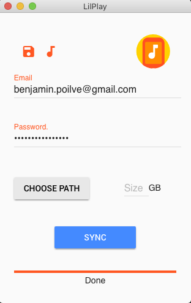
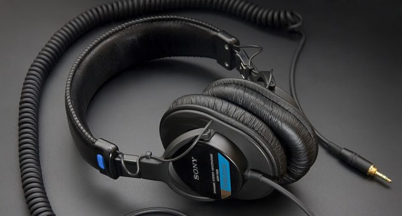
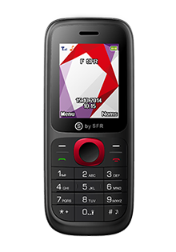

# Lilplay

## Usage

Lilplay is a little electron executable that connects to you google play account and downloads the favorite songs into a choosen folder.

It can remember the informations you gave him and convert to Wav (my phone does not support mp3)

## Story

I love google play music. 

I used to be a music hoarder, obsessed by having full discography of every artists, always comparing with friends how many Gigas of music I had on my drives.. 

When streaming services appeared, I thought it was dumb
. Who would pay not to own the music? Seemed weird. 

In the end, subscribing to google play was the best things that happened to me! I am always listening different things, sharing playlists with my friends, exploring different style and artists. 

Trouble is, a month ago, my headset claimed another victim. The MDR7506 is probably the greatest headphone I ever owned, but its heavy cable puts too much pressure on the crappy headphones jack that manufacturer use these days. 

Death toll:

* Ipod Mini
* Ipod Classic
* Iriver DX50
* Archos Helium

Tried to fix it, (which technically worked) but ended up having to permanently solder the jack presence pad, so no speaker sound, and damaged the vibration connector, so no vibration. 
That makes a phone pretty useless.

So once again I was without a proper listening device. Well my replacement dumbphone had a jack, but google play isn't exactly dumbphone friendly!

I decided to change that! 

### Disclaimer:

The goal of this project is not to mess with google in any way. I gladly pay 10$ a month for a great service, and it turned out it did not cover all of my use cases. Since I knew how to fix that, I did, and shared my code. 

If your intention is to modify this to make massive downloads on google play, I can't stop you, but remember, you are the reason we can't have nice things. Plus, I am sure google guys are smart enough to detect such behaviour. 

The fight on music is over, and everybody realised that a good enough service was all that was needed to have people stop pirating. This project goal is to make this service even better, not to advocate breach of TOS. 

## FAQ/TroubleShooting

* Talk about [app password](https://support.google.com/accounts/answer/185833?hl=fr) for 2FA users
* Need to have used google play on the machine before

